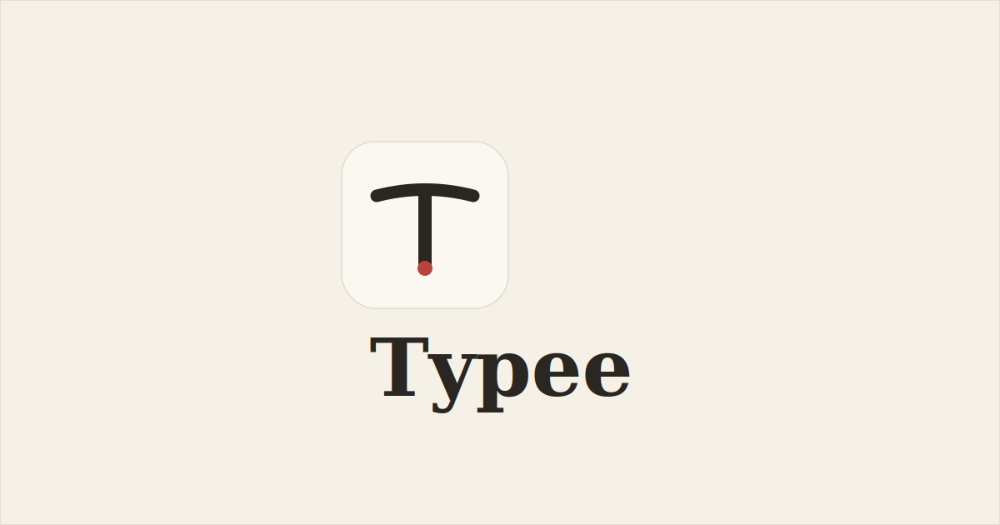

# Typee

A single-page Markdown editor. Paper-textured, distraction-free, and fully local — nothing you write ever leaves your browser.

**[Live demo →](https://typee.pacify.site)**



## What it is

Typee is one full-page canvas for writing Markdown, with a small draggable panel in the corner holding everything else. No sidebar, no dashboard, no sign-up, no account, no server.

- **Tabs** — multiple notes in the same session (`Ctrl+Alt+N` new, `Ctrl+Alt+W` close, `Ctrl+Alt+[ ]` cycle, double-click to rename). Everything stays local.
- **Split** — write raw Markdown on the left, see it rendered live on the right
- **Flow** — a single pane where your Markdown syntax resolves inline as you type (bold, italic, headings, quotes — WYSIWYG-style, syntax marks stay dimly visible so nothing feels hidden)
- **Write** — full-width raw editor, no distractions
- **Read** — full-width rendered preview
- **Night page** — a warm, ink-on-dark theme toggled with a small icon button in the panel
- **Export** — download as `.md` or a self-contained styled `.html` file, or copy the rendered text
- Everything autosaves to `localStorage` as you type

## Why it looks the way it does

The design brief was "paper, not dashboard." Warm cream background, a subtle grain texture, a serif body face (Source Serif 4) for the writing surface, and a humanist sans (Inter) reserved only for the small UI chrome in the panel. The floating panel itself is treated like a physical sticky note — slightly tilted, real drag physics, its own soft shadow.

## Running it

It's a single HTML file. Open `index.html` directly in any modern browser, or serve the folder:

```bash
python3 -m http.server 8000
# → http://localhost:8000
```

No build step, no dependencies, no `npm install`. The only external requests are two Google Fonts (Source Serif 4, Inter) — everything else, including the Markdown engine, runs entirely client-side with zero libraries.

## Project structure

```
typee/
├── index.html              # the whole app — markup, styles, and logic
├── assets/
│   ├── favicon.svg          # the T mark (no background)
│   └── og-image.png         # social share preview image
├── LICENSE
└── README.md
```

## Markdown support

Typee ships a small hand-written Markdown renderer (no `marked`/`markdown-it`/etc — kept dependency-free on purpose):

- Headings (`#`, `##`, `###`)
- Bold, italic, bold+italic, strikethrough
- Inline code and fenced code blocks
- Blockquotes
- Ordered and unordered lists
- Links and images
- Horizontal rules

## License

MIT — see [LICENSE](LICENSE).
